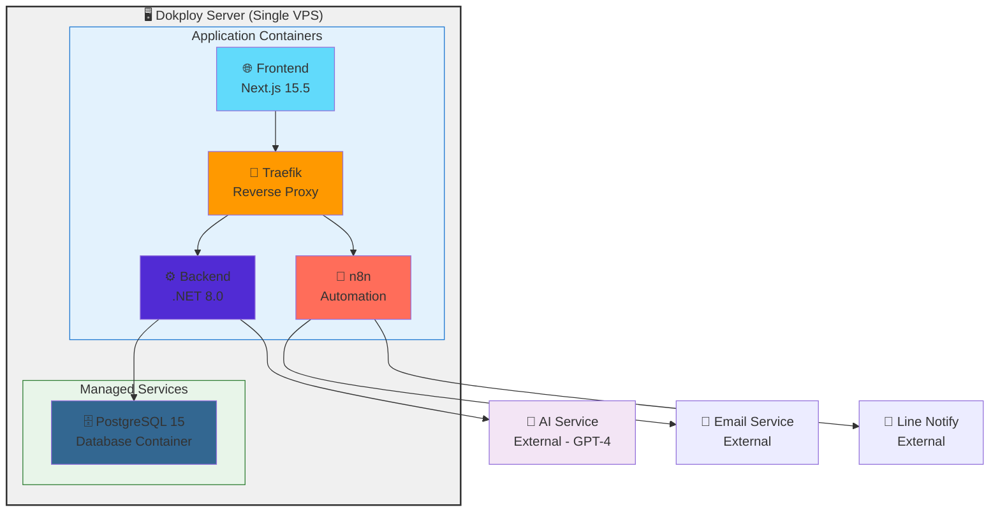
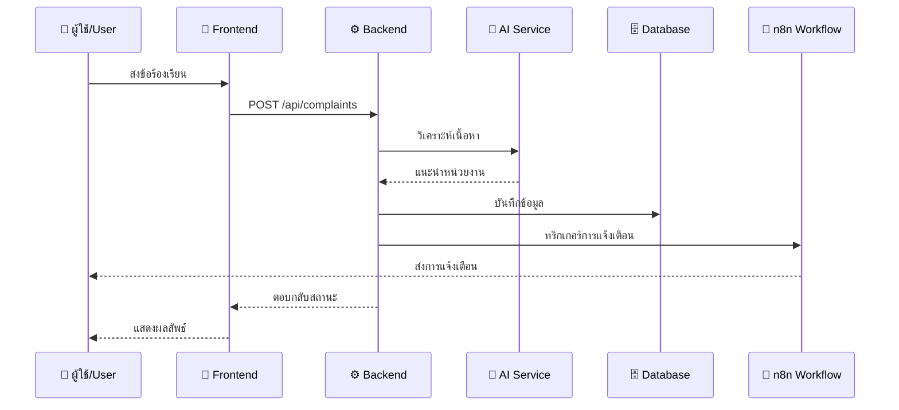

# 🚀 SCH-KPRU: ระบบจัดการข้อร้องเรียนอัจฉริยะ
### Smart Complaint Hub with AI Integration

<div align="center">
  
  
  
  
  
  
  
</div>

<div align="center">
  <p><strong>🎓 ระบบจัดการข้อร้องเรียนด้วยปัญญาประดิษฐ์สำหรับระบบสายตรงคณบดี คณะวิทยาศาสตร์และเทคโนโลยี มหาวิทยาลัยราชภัฏกำแพงเพชร</strong></p>
  <p><em>AI-powered complaint management system for enhanced governance and transparency at Sci-Tech KPRU</em></p>
</div>

---

## 📄 สารบัญ | Table of Contents

- [🎯 เกี่ยวกับโครงการ](#-เกี่ยวกับโครงการ)
- [✨ คุณสมบัติหลัก](#-คุณสมบัติหลัก)
- [🛠️ เทคโนโลยีที่ใช้](#️-เทคโนโลยีที่ใช้)
- [🚀 การติดตั้งและใช้งาน](#-การติดตั้งและใช้งาน)
- [📁 โครงสร้างโปรเจกต์](#-โครงสร้างโปรเจกต์)
- [🔗 API Endpoints](#-api-endpoints)
- [🤝 การมีส่วนร่วม](#-การมีส่วนร่วม)
- [📄 สิทธิ์การใช้งาน](#-สิทธิ์การใช้งาน)

## � About the Project

## 🎯 เกี่ยวกับโครงการ | About the Project

ระบบ **SCH-KPRU** เป็นระบบจัดการข้อร้องเรียนที่ขับเคลื่อนด้วยปัญญาประดิษฐ์ (AI) ซึ่งได้รับการพัฒนาขึ้นเพื่อปรับปรุงและยกระดับการจัดการข้อร้องเรียนของ **ระบบสายตรงคณบดี คณะวิทยาศาสตร์และเทคโนโลยี มหาวิทยาลัยราชภัฏกำแพงเพชร**

**SCH-KPRU** is an innovative AI-powered complaint management system designed to revolutionize complaint handling processes at the **Faculty of Science and Technology, Kamphaeng Phet Rajabhat University (KPRU)**.

### 🎯 วัตถุประสงค์ | Project Objectives

| 🇹🇭 ภาษาไทย | 🇺🇸 English |
|-------------|-------------|
| 🤖 **ใช้ AI วิเคราะห์และจัดเส้นทางข้อร้องเรียนอัตโนมัติ** | **Automate** complaint analysis and department routing using AI |
| 🔍 **เพิ่มความโปร่งใสในกระบวนการแก้ไขข้อร้องเรียน** | **Enhance** transparency in complaint resolution processes |
| ⚡ **ปรับปรุงเวลาตอบสนองและประสิทธิภาพการบริหาร** | **Improve** response times and governance efficiency |
| 📊 **จัดให้มีระบบติดตามแบบเรียลไทม์** | **Provide** real-time tracking for all stakeholders |
| � **ปรับปรุงการสื่อสารผ่านการแจ้งเตือนอัตโนมัติ** | **Streamline** communication through automated notifications |

## ✨ คุณสมบัติหลัก | Key Features

### 🤵 ส่วนสำหรับผู้ร้องเรียน | Public Interface
- **📝 ส่งข้อร้องเรียน**: แบบฟอร์มเว็บที่ใช้งานง่าย
- **🎫 ติดตามสถานะ**: ระบบ Ticket ID เฉพาะสำหรับติดตามสถานะแบบเรียลไทม์
- **🔍 อัปเดตสถานะ**: ติดตามความคืบหนน้าการแก้ไขข้อร้องเรียนแบบ Real-Time

### 🤖 การวิเคราะห์ด้วย AI | AI-Powered Analysis
- **📊 การจัดเส้นทางอัจฉริยะ**: AI วิเคราะห์อัตโนมัติเพื่อแนะนำหน่วยงานที่เหมาะสม
- **📈 การจดจำรูปแบบ**: ความเข้าใจจากการเรียนรู้ของเครื่องสำหรับการจัดหมวดหมู่ข้อร้องเรียน
- **⚡ การประมวลผลทันที**: การวิเคราะห์และจัดเส้นทางข้อร้องเรียนแบบเรียลไทม์

### 🛡️ แดชบอร์ดสำหรับผู้บริหาร | Administrative Dashboard
- **👑 แดชบอร์ดคณบดี**: ภาพรวมผู้บริหารพร้อมการวิเคราะห์และรายงาน
- **👥 การจัดการหน่วยงาน**: การเข้าถึงตามบทบาทสำหรับเจ้าหน้าที่และคณะกรรมการ
- **📋 การจัดการงาน**: การมอบหมายและติดตามการแก้ไขข้อร้องเรียน

### � การแจ้งเตือนอัตโนมัติ | Automated Notification
- **📧 แจ้งเตือนทางอีเมล**: การอัปเดตอีเมลอัตโนมัติไปยังผู้เกี่ยวข้อง
- **💬 การแจ้งเตือนผ่าน Line**: การแจ้งเตือนแบบเรียลไทม์ผ่านแอพ Line
- **📱 การแจ้งเตือนหลายช่องทาง**: ระบบแจ้งเตือนที่ครอบคลุม

### 🔐 ระบบความปลอดภัย | Security Features
- **🛡️ การยืนยันตัวตน JWT**: ระบบล็อกอินที่ปลอดภัยด้วย JSON Web Tokens
- **�️ การจัดการบทบาท**: ระบบควบคุมการเข้าถึงตามบทบาทผู้ใช้
- **🔒 การเข้ารหัสข้อมูล**: การป้องกันข้อมูลที่อ่อนไหวด้วยการเข้ารหัส

## 🛠️ เทคโนโลยีที่ใช้ | Technology Stack

<div align="center">

| ชั้น Layer | เทคโนโลยี Technology | เวอร์ชัน Version | คำอธิบาย Description |
|------------|---------------------|------------------|---------------------|
| **Frontend** |  | 15.5.2 | Modern React framework พร้อม TypeScript และ TailwindCSS |
| **UI/UX** |  | 19.1.0 | Component-based user interface library |
| **Styling** |  | 4.0+ | Utility-first CSS framework for rapid UI development |
| **Language** |  | 5.0+ | Type-safe JavaScript for better development experience |
| **Backend** |  | 8.0 | High-performance RESTful API with authentication |
| **Database** |  | 15.0+ | Advanced relational database with JSON support |
| **ORM** |  | 9.0.8 | Modern database access technology for .NET |
| **Automation** |  | Latest | Visual workflow automation platform |
| **AI/ML** |  | GPT-4+ | Large Language Model for intelligent analysis |

</div>

### 📦 แพ็กเกจสำคัญ | Key Dependencies

**🎨 Frontend Dependencies:**
```json
{
  "next": "15.5.2",           // React framework with app router
  "react": "19.1.0",          // UI library
  "typescript": "^5",         // Type safety
  "tailwindcss": "^4",        // CSS framework
  "next-intl": "^4.3.5"       // Internationalization
}
```

**⚙️ Backend Dependencies:**
```xml
<PackageReference Include="Microsoft.EntityFrameworkCore" Version="9.0.8" />
<PackageReference Include="Npgsql.EntityFrameworkCore.PostgreSQL" Version="9.0.0" />
<PackageReference Include="System.IdentityModel.Tokens.Jwt" Version="8.14.0" />
<PackageReference Include="Swashbuckle.AspNetCore" Version="6.6.2" />
```

### 🏗️ สถาปัตยกรรมระบบ | System Architecture



### 🔄 ขั้นตอนการทำงาน | Workflow Process



## 🚀 การติดตั้งและใช้งาน | Getting Started

### 📋 สิ่งที่ต้องเตรียม | Prerequisites

ก่อนเริ่มติดตั้ง กรุณาตรวจสอบให้แน่ใจว่าคุณได้ติดตั้งซอฟต์แวร์ต่อไปนี้แล้ว:

**Before you begin, ensure you have the following installed:**

| ซอฟต์แวร์ Software | เวอร์ชัน Version | ลิงก์ดาวน์โหลด Download Link |
|-------------------|------------------|-------------------------------|
| 🔧 **Docker** | 24.0+ | [docker.com](https://www.docker.com/) |
| 🐳 **Docker Compose** | 2.0+ | [docs.docker.com](https://docs.docker.com/compose/) |
| 🔧 **Make** | Latest | [gnu.org](https://www.gnu.org/software/make/) |
| 💻 **VS Code** | Latest | [code.visualstudio.com](https://code.visualstudio.com/) |

### ⚡ การติดตั้งอย่างรวดเร็ว | Quick Installation

#### 1️⃣ **📥 โคลนโปรเจกต์ | Clone Repository**
```powershell
# Clone the repository
git clone https://github.com/hamhapichai/SCH-KPRU.git
cd SCH-KPRU
```

#### 2️⃣ **⚙️ ตั้งค่าตัวแปรสภาพแวดล้อม | Environment Setup**
```powershell
# Copy environment file
copy .env.prod .env.prod.local

# Edit .env.prod.local with your production values
# - POSTGRES_PASSWORD: Set a strong password for PostgreSQL
# - JWT_SECRET: Generate a secure JWT secret key
# - API_URL: Set your API base URL
```

#### 3️⃣ **🏗️ สร้างและเริ่มระบบ | Build and Deploy**
```powershell
# For Production
make prod-build
make prod-up

# For Development
make dev-build
make dev-up
```

✅ **ระบบจะทำงานที่: `http://localhost`**

### 🌟 คำสั่งสำหรับการพัฒนา | Development Commands

| คำสั่ง Command | คำอธิบาย Description | วิธีใช้ Usage |
|----------------|---------------------|-------------------|
| `make dev-build` | สร้าง services สำหรับพัฒนา | Development build |
| `make dev-up` | เริ่ม services พัฒนา | Start development services |
| `make dev-logs` | ดู logs พัฒนา | View development logs |
| `make prod-build` | สร้าง services สำหรับใช้งานจริง | Production build |
| `make prod-up` | เริ่ม services ใช้งานจริง | Start production services |
| `make prod-logs` | ดู logs ใช้งานจริง | View production logs |
| `make status` | ตรวจสอบสถานะ services | Check service status |
| `make health` | ตรวจสอบสุขภาพระบบ | Check system health |

### 🔧 การกำหนดค่า Environment Variables

สร้างไฟล์ `.env.prod.local` จาก `.env.prod` และกำหนดค่าต่อไปนี้:

```env
# Database
POSTGRES_PASSWORD=your_secure_postgres_password_here

# Security
JWT_SECRET=your_very_secure_jwt_secret_key_here

# URLs
API_URL=http://localhost/api
NEXT_PUBLIC_API_URL=http://localhost/api
```

### 🎯 การเข้าถึงระบบ | System Access

| ระบบ System | URL | คำอธิบาย Description |
|-------------|-----|---------------------|
| 🎨 **แอพพลิเคชันหลัก** | http://localhost | หน้าเว็บและแดชบอร์ด |
| ⚙️ **API Documentation** | http://localhost/api/swagger | เอกสาร API |
| 🗄️ **ฐานข้อมูล** | localhost:5432 | PostgreSQL (ภายใน Docker) |
| 📊 **PgAdmin** | http://localhost:5050 | จัดการฐานข้อมูล (พัฒนา) |
| 💚 **Health Check** | http://localhost/health | ตรวจสอบสถานะระบบ |

## 📁 โครงสร้างโปรเจกต์ | Project Structure

```
SCH-KPRU/
├── 📂 backend/                         # .NET 8.0 Web API
│   └── 📁 SchKpruApi/                  # Main API Project
│       ├── 🎮 Controllers/             # API Controllers
│       │   ├── AISuggestionsController.cs    # AI suggestions management
│       │   ├── AuthController.cs              # Authentication & authorization
│       │   ├── ComplaintsController.cs        # Complaint CRUD operations
│       │   ├── DepartmentsRolesController.cs  # Department & role management
│       │   ├── GroupsController.cs            # User groups management
│       │   ├── PublicController.cs            # Public endpoints
│       │   └── UsersController.cs             # User management
│       ├── 📊 Models/                        # Database Models
│       │   ├── AISuggestion.cs               # AI suggestion entity
│       │   ├── Complaint.cs                  # Complaint entity
│       │   ├── ComplaintAssignment.cs        # Assignment entity
│       │   ├── ComplaintLog.cs               # Activity log entity
│       │   ├── Department.cs                 # Department entity
│       │   ├── Group.cs                      # Group entity
│       │   ├── Member.cs                     # Group member entity
│       │   ├── Role.cs                       # User role entity
│       │   └── User.cs                       # User entity
│       ├── 🔧 Services/                      # Business Logic Services
│       │   └── [Business services]           # Service implementations
│       ├── 🗃️ Repositories/                  # Data Access Layer
│       │   ├── AISuggestionRepository.cs     # AI suggestion repository
│       │   ├── ComplaintRepository.cs        # Complaint repository
│       │   ├── ComplaintAssignmentRepository.cs # Assignment repository
│       │   ├── ComplaintLogRepository.cs     # Log repository
│       │   ├── DepartmentRepository.cs       # Department repository
│       │   ├── GroupRepository.cs            # Group repository
│       │   ├── GenericRepository.cs          # Generic repository pattern
│       │   ├── IGenericRepository.cs         # Generic repository interface
│       │   └── [Other repository interfaces] # Repository interfaces
│       ├── 📦 DTOs/                         # Data Transfer Objects
│       │   ├── AISuggestionDtos.cs          # AI suggestion DTOs
│       │   ├── ComplaintDtos.cs             # Complaint DTOs
│       │   ├── DepartmentDtos.cs            # Department DTOs
│       │   ├── GroupDtos.cs                 # Group DTOs
│       │   └── UserDtos.cs                  # User DTOs
│       ├── 🗂️ Migrations/                   # EF Core Migrations
│       │   ├── 20250914075947_InitialCreate.cs
│       │   ├── 20250914183000_AddN8nWorkflowIdToAISuggestion.cs
│       │   └── ApplicationDbContextModelSnapshot.cs
│       ├── ⚙️ Data/                         # Database Context
│       │   └── ApplicationDbContext.cs      # EF Core DbContext
│       ├── 📄 appsettings.json              # ⚠️ Application settings (NOT to commit)
│       ├── 📄 appsettings.Development.json  # ⚠️ Development settings (NOT to commit)
│       ├── 📄 Program.cs                    # Application entry point
│       ├── 📄 SchKpruApi.csproj             # Project file
│       ├── 📄 SchKpruApi.http               # ⚠️ API test file (NOT to commit)
│       └── 📁 Properties/                   # Project properties
├── 📂 frontend/                            # Next.js 15.5 Application
│   ├── 📁 src/                             # Source Code
│   │   ├── 🎨 components/                   # Reusable Components
│   │   ├── 🔧 lib/                         # Utility Functions
│   │   ├── 📱 pages/                       # Next.js Pages
│   │   ├── 🔗 types/                       # TypeScript Types
│   │   └── 🎯 styles/                      # Global Styles
│   ├── 📄 package.json                     # Dependencies
│   ├── 📄 next.config.ts                   # Next.js Configuration
│   ├── 📄 tailwind.config.ts               # TailwindCSS Configuration
│   ├── 📄 tsconfig.json                    # TypeScript Configuration
│   └── 📄 eslint.config.mjs                # ESLint Configuration
├── 📂 n8n/                                # Workflow Automation
│   └── 📄 kpru-cms-updated.json            # AI workflow definition
├── 📄 SCH-KPRU.sln                        # Visual Studio Solution
├── 📄 README.md                           # Project Documentation
├── 📄 LICENSE                             # MIT License
└── 📄 .gitignore                          # Git ignore rules
```

### 🔗 API Endpoints | API Reference

### 🔐 การยืนยันตัวตน | Authentication
```http
POST   /api/auth/login          # เข้าสู่ระบบ | User login
POST   /api/auth/register       # ลงทะเบียนผู้ใช้ | User registration
POST   /api/auth/refresh        # รีเฟรช JWT token | Refresh JWT token
POST   /api/auth/logout         # ออกจากระบบ | User logout
```

### 📝 การจัดการข้อร้องเรียน | Complaints Management
```http
GET    /api/complaints          # รายการข้อร้องเรียนทั้งหมด | List all complaints
POST   /api/complaints          # ส่งข้อร้องเรียนใหม่ | Submit new complaint
GET    /api/complaints/{id}     # รายละเอียดข้อร้องเรียน | Get complaint details
PUT    /api/complaints/{id}     # อัพเดตสถานะข้อร้องเรียน | Update complaint status
DELETE /api/complaints/{id}     # ลบข้อร้องเรียน | Delete complaint
GET    /api/complaints/{id}/history # ประวัติการเปลี่ยนแปลง | Complaint history
GET    /api/complaints/track/{ticketId} # ติดตามโดย Ticket ID | Track by ticket ID
```

### 🤖 AI Suggestions | AI Suggestions
```http
GET    /api/AISuggestions       # รายการคำแนะนำ AI | List all AI suggestions
POST   /api/AISuggestions       # สร้างคำแนะนำใหม่ | Create new AI suggestion
GET    /api/AISuggestions/{id}  # รายละเอียดคำแนะนำ | Get suggestion details
PUT    /api/AISuggestions/{id}  # อัพเดตคำแนะนำ | Update suggestion
DELETE /api/AISuggestions/{id}  # ลบคำแนะนำ | Delete suggestion
POST   /api/admin/AISuggestions/callback # Webhook callback | AI callback endpoint
```

### 🏢 การจัดการหน่วยงาน | Departments Management
```http
GET    /api/departments         # รายการหน่วยงาน | List all departments
POST   /api/departments         # สร้างหน่วยงานใหม่ | Create new department
GET    /api/departments/{id}    # รายละเอียดหน่วยงาน | Get department details
PUT    /api/departments/{id}    # อัพเดตข้อมูลหน่วยงาน | Update department
DELETE /api/departments/{id}    # ลบหน่วยงาน | Delete department
```

### 👥 การจัดการผู้ใช้ | Users Management
```http
GET    /api/users               # รายการผู้ใช้ | List all users
POST   /api/users               # สร้างผู้ใช้ใหม่ | Create new user
GET    /api/users/{id}          # รายละเอียดผู้ใช้ | Get user details
PUT    /api/users/{id}          # อัพเดตข้อมูลผู้ใช้ | Update user
DELETE /api/users/{id}          # ลบผู้ใช้ | Delete user
GET    /api/users/profile       # โปรไฟล์ผู้ใช้ปัจจุบัน | Current user profile
```

### 👥 การจัดการกลุ่ม | Groups Management
```http
GET    /api/groups              # รายการกลุ่ม | List all groups
POST   /api/groups              # สร้างกลุ่มใหม่ | Create new group
GET    /api/groups/{id}         # รายละเอียดกลุ่ม | Get group details
PUT    /api/groups/{id}         # อัพเดตกลุ่ม | Update group
DELETE /api/groups/{id}         # ลบกลุ่ม | Delete group
POST   /api/groups/{id}/members # เพิ่มสมาชิก | Add group member
DELETE /api/groups/{id}/members/{userId} # ลบสมาชิก | Remove group member
```

### 🎫 การจัดการบทบาทและสิทธิ์ | Roles & Permissions
```http
GET    /api/departmentsroles     # รายการบทบาทตามหน่วยงาน | List department roles
POST   /api/departmentsroles     # สร้างบทบาทใหม่ | Create new role
GET    /api/departmentsroles/{id} # รายละเอียดบทบาท | Get role details
PUT    /api/departmentsroles/{id} # อัพเดตบทบาท | Update role
DELETE /api/departmentsroles/{id} # ลบบทบาท | Delete role
```

### 🌐 จุดสิ้นสุดสาธารณะ | Public Endpoints
```http
GET    /api/public/complaints   # แบบฟอร์มส่งข้อร้องเรียน | Public complaint form
POST   /api/public/complaints   # ส่งข้อร้องเรียนแบบไม่เข้าสู่ระบบ | Submit anonymous complaint
GET    /api/public/status/{ticketId} # ตรวจสอบสถานะ | Check complaint status
```

### 📊 รายงานและสถิติ | Reports & Analytics
```http
GET    /api/complaints/reports/dashboard # ข้อมูลแดชบอร์ด | Dashboard data
GET    /api/complaints/reports/statistics # สถิติข้อร้องเรียน | Complaint statistics
GET    /api/complaints/reports/departments # รายงานตามหน่วยงาน | Department reports
GET    /api/complaints/reports/trends # แนวโน้มข้อร้องเรียน | Complaint trends
```

### 📋 ตัวอย่างการเรียก API | API Usage Examples

**🔐 การเข้าสู่ระบบ | Login Example:**
```http
POST /api/auth/login
Content-Type: application/json

{
  "username": "admin@kpru.ac.th",
  "password": "your_password"
}
```

**📝 การส่งข้อร้องเรียน | Submit Complaint Example:**
```http
POST /api/complaints
Content-Type: application/json
Authorization: Bearer {your_jwt_token}

{
  "contactName": "ชื่อผู้ร้องเรียน",
  "contactEmail": "email@example.com",
  "contactPhone": "0812345678",
  "subject": "หัวข้อเรื่องร้องเรียน",
  "message": "รายละเอียดของเรื่องร้องเรียน",
  "isAnonymous": false
}
```

**📊 การขอข้อมูลสถิติ | Get Statistics Example:**
```http
GET /api/complaints/reports/statistics?startDate=2025-01-01&endDate=2025-12-31
Authorization: Bearer {your_jwt_token}
```

**🤖 การส่งคำแนะนำ AI | AI Suggestion Callback:**
```http
POST /api/admin/AISuggestions/callback
Content-Type: application/json

{
  "ComplaintId": 1,
  "SuggestedDeptId": 2,
  "SuggestedCategory": "IT Support",
  "SummarizedByAI": "AI analysis summary",
  "ConfidenceScore": 0.85
}
```

## 🤝 การมีส่วนร่วม | Contributing

เรายินดีต้อนรับการมีส่วนร่วมจากทุกคน! กรุณาอ่านคำแนะนำต่อไปนี้ก่อนเริ่มพัฒนา

**We welcome contributions from everyone! Please read the following guidelines before starting development.**

### 🚀 วิธีการมีส่วนร่วม | How to Contribute

1. **🍴 Fork โปรเจกต์ | Fork the Project**
2. **🌿 สร้าง Feature Branch | Create Feature Branch**
   ```bash
   git checkout -b feature/AmazingFeature
   ```
3. **💾 Commit การเปลี่ยนแปลง | Commit Changes**
   ```bash
   git commit -m 'Add some AmazingFeature'
   ```
4. **📤 Push ไปยัง Branch | Push to Branch**
   ```bash
   git push origin feature/AmazingFeature
   ```
5. **🔄 เปิด Pull Request | Open Pull Request**

### 📝 มาตรฐานการเขียนโค้ด | Coding Standards

**🎯 Backend (.NET):**
- ใช้ **C# Coding Conventions** ตามมาตรฐาน Microsoft
- เขียน **Unit Tests** สำหรับฟีเจอร์ใหม่
- ใช้ **async/await** สำหรับการทำงานแบบ asynchronous
- ตั้งชื่อตัวแปรและฟังก์ชันให้สื่อความหมาย

**🎨 Frontend (Next.js):**
- ใช้ **TypeScript** อย่างเข้มงวด
- ติดตั้งและใช้ **ESLint** + **Prettier**
- ใช้ **TailwindCSS** สำหรับ styling
- สร้าง **Component** ที่ reusable

**🗄️ Database:**
- ใช้ **Entity Framework Migrations** สำหรับการเปลี่ยนแปลง schema
- เขียน **Seed Data** สำหรับข้อมูลเริ่มต้น
- ตั้งชื่อตาราง และคอลัมน์ให้เป็นมาตรฐาน

### 🧪 การทดสอบ | Testing

**📱 Frontend Testing:**
```bash
cd frontend
npm run test        # Run unit tests
npm run lint        # Check code quality
npm run build       # Test production build
```

**⚙️ Backend Testing:**
```bash
cd backend/SchKpruApi
dotnet test         # Run unit tests
dotnet format       # Format code
dotnet build        # Build project
```

### 📚 การเขียน Documentation

- อัพเดต **README.md** หากเพิ่มฟีเจอร์ใหม่
- เขียน **XML Comments** สำหรับ public methods
- อัพเดต **API Documentation** ใน Swagger
- เพิ่ม **Example Usage** ถ้าจำเป็น

### 👨‍💻 ทีมพัฒนา | Development Team

| บทบาท Role | ชื่อ Name | ติดต่อ Contact |
|------------|-----------|----------------|
| **🎯 Project Lead** | Apichai Butdee | [@hamhapichai](https://github.com/hamhapichai) |
| **🎓 Academic Advisor** | Assoc. Prof. Dr. Bhoomin Tanut | KPRU Faculty |
| **💻 Contributors** | Open for Contributors | Welcome! |

## 🐛 การแก้ปัญหา | Troubleshooting

### ❗ ปัญหาที่พบบ่อย | Common Issues

#### 🗄️ **ปัญหาการเชื่อมต่อฐานข้อมูล | Database Connection Issues**

**🔍 ตรวจสอบ:**
```powershell
# ตรวจสอบว่า PostgreSQL ทำงานหรือไม่
Get-Process postgres
# หรือ
docker ps | findstr postgres

# ทดสอบการเชื่อมต่อ
psql -h localhost -p 5432 -U postgres -d sch_kpru_web_development
```

**🔧 แก้ไข:**
```powershell
# รีสตาร์ท PostgreSQL (Docker)
docker restart sch-kpru-db

# รีเซ็ตฐานข้อมูล
cd backend/SchKpruApi
dotnet ef database drop --force
dotnet ef database update
```

#### 🎨 **ปัญหา Frontend Build Error**

**🔍 อาการ:** `npm run build` หรือ `npm run dev` error

**🔧 แก้ไข:**
```powershell
cd frontend

# ลบ cache และ reinstall
Remove-Item -Recurse -Force node_modules, .next, package-lock.json
npm install

# หรือใช้ npm cache clean
npm cache clean --force
npm install
```

#### ⚙️ **ปัญหา Backend API ไม่ทำงาน | Backend API Not Starting**

**🔍 ตรวจสอบ Port:**
```powershell
# ตรวจสอบว่า port 5001 ถูกใช้หรือไม่
netstat -ano | findstr :5001

# หรือใช้ PowerShell
Get-NetTCPConnection -LocalPort 5001
```

**🔧 แก้ไข:**
```powershell
cd backend/SchKpruApi

# ล้างและ restore packages
dotnet clean
dotnet restore
dotnet build

# เช็ค configuration
dotnet run --launch-profile Development
```

#### 🔒 **ปัญหา HTTPS Certificate**

**🔍 อาการ:** เบราว์เซอร์แจ้งเตือน certificate error

**🔧 แก้ไข:**
```powershell
# สร้าง development certificate ใหม่
dotnet dev-certs https --clean
dotnet dev-certs https --trust

# สำหรับ PowerShell
dotnet dev-certs https -ep "$env:USERPROFILE\.aspnet\https\aspnetapp.pfx" -p password
```

#### 🤖 **ปัญหา AI Service ไม่ทำงาน**

**🔍 ตรวจสอบ:** API key และ configuration

**🔧 แก้ไข:**
```bash
# ตรวจสอบ environment variables
echo $OPENAI_API_KEY
# หรือใน PowerShell
$env:OPENAI_API_KEY
```

### 🔧 เครื่องมือ Debug | Debug Tools

#### 📊 **Database Debugging:**
```sql
-- ตรวจสอบตารางในฐานข้อมูล
\dt

-- ตรวจสอบข้อมูล complaints
SELECT * FROM "Complaints" ORDER BY "SubmittedAt" DESC LIMIT 10;

-- ตรวจสอบ connection string
SHOW all;
```

#### 🌐 **API Debugging:**
```http
# ทดสอบ API health check
GET https://localhost:5001/api/health

# ดู Swagger documentation
GET https://localhost:5001/swagger
```

#### 📱 **Frontend Debugging:**
```powershell
# ดูเวอร์ชัน dependencies
npm list

# ตรวจสอบ TypeScript errors
npm run type-check

# ดู build logs
npm run build -- --verbose
```

### 📋 Logs และการ Monitor | Logs & Monitoring

#### ⚙️ **Backend Logs:**
```powershell
# ดู application logs
cd backend/SchKpruApi
dotnet run --verbosity normal

# หรือใช้ structured logging
dotnet run --configuration Development
```

#### 🎨 **Frontend Logs:**
```powershell
# Development server logs
npm run dev -- --verbose

# Build process logs
npm run build -- --debug
```

#### 🐳 **Docker Logs:**
```powershell
# ดู PostgreSQL logs
docker logs sch-kpru-db

# ดู n8n logs
docker logs sch-kpru-n8n -f
```

## 📄 สิทธิ์การใช้งาน | License

โครงการนี้ได้รับอนุญาตภายใต้ **MIT License** - ดูรายละเอียดได้ที่ไฟล์ [LICENSE](LICENSE)

**This project is licensed under the MIT License** - see the [LICENSE](LICENSE) file for details.

### 🔓 MIT License Summary

✅ **อนุญาต | Permissions:**
- ✔️ การใช้งานเชิงพาณิชย์ | Commercial use
- ✔️ การปรับปรุง | Modification
- ✔️ การแจกจ่าย | Distribution
- ✔️ การใช้งานส่วนตัว | Private use

❌ **ข้อจำกัด | Limitations:**
- ❌ ไม่รับประกัน | No warranty
- ❌ ไม่รับผิดชอบ | No liability

📋 **เงื่อนไข | Conditions:**
- ☑️ ต้องรวม license และ copyright notice

---

## 🏆 กิตติกรรมประกาศ | Acknowledgments

### 🎓 **สถาบันการศึกษา | Academic Institution**
- **🏛️ มหาวิทยาลัยราชภัฏกำแพงเพชร** สำหรับการสนับสนุนโครงการ
- **🔬 คณะวิทยาศาสตร์และเทคโนโลยี** สำหรับการให้คำปรึกษาและทรัพยากร
- **Faculty of Science and Technology, KPRU** for project support and guidance

### 👨‍🏫 **ที่ปรึกษาโครงการ | Project Advisors**
- **Assoc. Prof. Dr. Bhoomin Tanut** - *Academic Supervision & Research Guidance*
- **อาจารย์ที่ปรึกษา** - *การให้คำแนะนำด้านวิชาการและการวิจัย*

### 🛠️ **เครื่องมือและเทคโนโลยี | Tools & Technologies**
- **🔓 Open Source Community** สำหรับเครื่องมือและ libraries ที่ยอดเยี่ยม
- **📚 .NET Foundation** สำหรับ ASP.NET Core framework
- **⚛️ Vercel Team** สำหรับ Next.js framework
- **🐘 PostgreSQL Global Development Group** สำหรับฐานข้อมูลที่เสถียร
- **🎨 Tailwind Labs** สำหรับ TailwindCSS framework

### 🌟 **Special Thanks**
- **💻 Microsoft** สำหรับ Visual Studio และ development tools
- **🐙 GitHub** สำหรับ platform การพัฒนาและ collaboration
- **🤖 OpenAI** สำหรับ AI/ML capabilities
- **🔄 n8n Community** สำหรับ workflow automation platform

**Thank you to all contributors who help improve this project:**

<div align="center">
  <a href="https://github.com/hamhapichai/SCH-KPRU/graphs/contributors">
    
  </a>
</div>

---

<div align="center">
  <h3>🎯 Project Status</h3>
  <p>
    
    
    
  </p>
</div>

<div align="center">
  <h3>💝 Made with Passion</h3>

  <p>
    <strong>⭐ ถ้าโครงการนี้มีประโยชน์ กรุณา Star Repository นี้!</strong><br>
    <strong>⭐ If you find this project helpful, please star this repository!</strong>
  </p>

  <p>
    <a href="https://github.com/hamhapichai/SCH-KPRU/stargazers">
      
    </a>
    <a href="https://github.com/hamhapichai/SCH-KPRU/network/members">
      
    </a>
  </p>
</div>

---

<div align="center">
  <h3>🔝 <a href="#-sch-kpru-ระบบจัดการข้อร้องเรียนอัจฉริยะ">Back to Top</a></h3>
</div>

---

<div align="center">
  <p><em>© 2025 SCH-KPRU Project. All rights reserved.</em></p>
  <p><em>Kamphaeng Phet Rajabhat University | มหาวิทยาลัยราชภัฏกำแพงเพชร</em></p>
</div>

---

## 🐳 Docker Production Deployment | Docker Production Deployment

### 📦 Docker Architecture Overview

```
SCH-KPRU Production Stack
├── 🎨 Frontend (Next.js + Nginx)
├── ⚙️ Backend (.NET 8.0 API)
├── 🗄️ PostgreSQL Database
└── 🌐 Nginx Reverse Proxy
```

### 🚀 Quick Docker Deployment

#### สำหรับ Production | For Production
```bash
# 1. Setup environment
make setup-env

# 2. Edit .env.prod.local with your values
# POSTGRES_PASSWORD, JWT_SECRET, etc.

# 3. Build and deploy
make prod-build
make prod-up

# 4. Check status
make status
```

#### สำหรับ Development | For Development
```bash
# 1. Build and deploy
make dev-build
make dev-up

# 2. View logs
make dev-logs

# 3. Access services
# Frontend: http://localhost
# Backend: http://localhost:8080
# PgAdmin: http://localhost:5050
```

### 📋 Docker Files Structure

```
SCH-KPRU/
├── 🐳 docker-compose.prod.yml    # Production services
├── 🐳 docker-compose.dev.yml     # Development overrides
├── 🐳 Makefile                   # Docker management commands
├── ⚙️ .env.prod                  # Production environment template
├── 🗄️ init-db.sql               # Database initialization
├── 🌐 nginx/
│   └── 📄 nginx.conf            # Reverse proxy configuration
├── ⚙️ backend/SchKpruApi/
│   ├── 🐳 Dockerfile            # Backend container
│   └── 📄 .dockerignore         # Backend build ignore
└── 🎨 frontend/
    ├── 🐳 Dockerfile            # Frontend container
    ├── 📄 nginx.conf            # Frontend nginx config
    └── 📄 .dockerignore         # Frontend build ignore
```

### 🔧 Docker Commands Reference

#### การจัดการ Services | Service Management
```bash
# Check service status
make status

# View logs
make prod-logs      # Production logs
make dev-logs       # Development logs

# Restart services
make prod-restart   # Production restart
make dev-restart    # Development restart

# Stop services
make prod-down      # Production stop
make dev-down       # Development stop
```

#### การจัดการฐานข้อมูล | Database Management
```bash
# Access database shell
make db-shell

# Backup database
make db-backup

# Restore database
make db-restore FILE=backup_file.sql

# Run migrations
make db-migrate
```

#### การ Build และ Deploy | Build & Deploy
```bash
# Production deployment
make deploy-prod

# Development deployment
make deploy-dev

# Rebuild specific services
make rebuild-backend
make rebuild-frontend
```

### 🔒 Security Considerations

#### Environment Variables
- ✅ อย่าคอมมิทไฟล์ `.env.prod.local` ขึ้น Git
- ✅ ใช้รหัสผ่านที่รัดกุมสำหรับฐานข้อมูล
- ✅ เปลี่ยน JWT secret เป็นคีย์ที่ปลอดภัย
- ✅ เปิดใช้งาน HTTPS ใน production

#### Docker Security
- 🔒 ใช้ non-root user ใน containers
- 🔒 จำกัด network access ระหว่าง services
- 🔒 เปิดเฉพาะ ports ที่จำเป็น
- 🔒 อัพเดต base images เป็นประจำ

### 📊 Monitoring & Maintenance

#### Health Checks
```bash
# Check all services health
make health

# Monitor resource usage
make monitor

# View disk usage
make disk-usage
```

#### Logs Management
```bash
# View specific service logs
make logs-backend
make logs-frontend
make logs-db

# Clean old logs
make maintenance-logs
```

#### Backup & Recovery
```bash
# Full system backup
make backup-all

# Emergency cleanup
make emergency-clean
```

### 🚨 Troubleshooting

#### ปัญหาที่พบบ่อย | Common Issues

**❌ Services ไม่สามารถเริ่มได้ | Services won't start**
```bash
# Check logs
make prod-logs

# Check environment variables
make check-env

# Restart services
make prod-restart
```

**❌ ไม่สามารถเชื่อมต่อฐานข้อมูล | Database connection failed**
```bash
# Check database status
make db-shell

# Check database logs
make logs-db

# Reset database
make db-migrate
```

**❌ Frontend ไม่โหลด | Frontend not loading**
```bash
# Check frontend logs
make logs-frontend

# Rebuild frontend
make rebuild-frontend
```

**❌ API ไม่ทำงาน | API not responding**
```bash
# Check backend logs
make logs-backend

# Check API health
curl http://localhost/api/health

# Rebuild backend
make rebuild-backend
```

### 🔄 CI/CD Integration

#### GitHub Actions Example
```yaml
name: Deploy to Production
on:
  push:
    branches: [ main ]
jobs:
  deploy:
    runs-on: ubuntu-latest
    steps:
    - uses: actions/checkout@v3
    - name: Deploy with Docker
      run: |
        make prod-build
        make prod-up
```

#### Docker Hub Integration
```bash
# Build and push images
docker build -t hamhapichai/sch-kpru-backend ./backend/SchKpruApi
docker build -t hamhapichai/sch-kpru-frontend ./frontend
docker push hamhapichai/sch-kpru-backend
docker push hamhapichai/sch-kpru-frontend
```

### 📈 Scaling & Performance

#### Horizontal Scaling
```yaml
# Scale backend services
docker-compose up -d --scale backend=3

# Load balancer configuration
upstream backend_api {
    server backend:8080;
    server backend:8081;
    server backend:8082;
}
```

#### Performance Optimization
- 🔧 ใช้ Redis สำหรับ caching
- 🔧 เปิดใช้งาน gzip compression
- 🔧 ตั้งค่า rate limiting
- 🔧 ใช้ CDN สำหรับ static assets

### 🌐 Production URLs Configuration

#### Domain Configuration
```env
# .env.prod.local
FRONTEND_URL=https://sch-kpru.kpru.ac.th
API_URL=https://api.sch-kpru.kpru.ac.th
```

#### Nginx SSL Configuration
```bash
# Generate SSL certificate
make ssl-generate

# Enable HTTPS
make ssl-enable

# Restart nginx
make restart-nginx
```

### 📞 Support & Documentation

สำหรับคำถามเพิ่มเติม สามารถติดต่อ:
- 📧 Email: admin@sch-kpru.kpru.ac.th
- 📚 Documentation: [Internal Wiki]
- 🐛 Issues: [GitHub Issues]

---

**🎉 Docker deployment setup completed! Your SCH-KPRU application is now ready for production deployment.**
