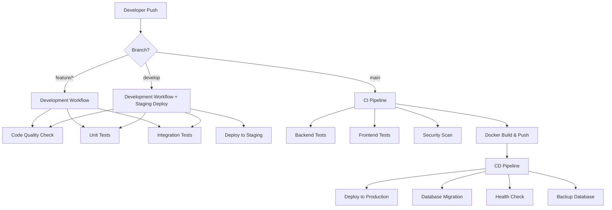

# 🚀 CI/CD Architecture Summary

## 📊 Workflow Overview



## 🔄 Pipeline Details

### 1. Development Workflow (`dev.yml`)
**Triggers**: `feature/*`, `hotfix/*`, `develop` branches
- ✅ Code quality checks (ESLint, Prettier, .NET analyzers)
- ✅ Unit tests (Backend + Frontend)
- ✅ Integration tests
- ✅ Deploy to staging (develop branch only)

### 2. CI Pipeline (`ci.yml`)
**Triggers**: Push/PR to `main` or `develop`
- ✅ Backend tests with PostgreSQL
- ✅ Frontend tests with Bun
- ✅ Security vulnerability scanning
- ✅ Docker image build and push to GHCR

### 3. CD Pipeline (`cd.yml`)
**Triggers**: Push to `main` or manual dispatch
- ✅ Deploy to production server via SSH
- ✅ Pull latest images from registry
- ✅ Database migrations
- ✅ Health checks
- ✅ Automatic database backup

## 🐳 Container Strategy

### Image Registry: GitHub Container Registry (GHCR)
- `ghcr.io/hamhapichai/sch-kpru/backend:latest`
- `ghcr.io/hamhapichai/sch-kpru/frontend:latest`

### Tagging Strategy
- `latest` → main branch
- `develop` → develop branch  
- `feature-name` → feature branches
- `main-abc1234` → commit SHA tags

## 🔧 Required GitHub Secrets

```bash
# Production Server
SSH_PRIVATE_KEY          # Server SSH private key
SERVER_HOST              # Server IP/domain
SERVER_USER              # Server username
PROJECT_PATH             # Project path on server

# Application
PRODUCTION_URL           # https://yourdomain.com
NEXT_PUBLIC_API_URL      # https://yourdomain.com/api
POSTGRES_PASSWORD        # Production DB password
JWT_SECRET               # JWT secret key

# Optional: Staging
STAGING_SSH_PRIVATE_KEY  # Staging server SSH key
STAGING_SERVER_HOST      # Staging server IP
STAGING_SERVER_USER      # Staging username
STAGING_PROJECT_PATH     # Staging project path
STAGING_URL              # https://staging.yourdomain.com
```

## 📋 Setup Checklist

### GitHub Repository Setup
- [ ] Enable GitHub Container Registry
- [ ] Configure GITHUB_TOKEN permissions (read/write)
- [ ] Add all required secrets
- [ ] Set up branch protection rules

### Server Setup
- [ ] Install Docker & Docker Compose
- [ ] Setup SSH key authentication
- [ ] Clone repository to project directory
- [ ] Configure `.env.prod` file
- [ ] Setup SSL certificates
- [ ] Configure firewall (ports 22, 80, 443)

### First Deployment
- [ ] Push to `develop` branch (staging deploy)
- [ ] Test staging environment
- [ ] Create PR to `main` branch
- [ ] Merge to `main` (production deploy)
- [ ] Verify production deployment

## 🚀 Deployment Commands

### Using Make (Recommended)
```bash
# CI/CD deployment
make cd-deploy

# Registry operations
make registry-login
make registry-pull
make registry-deploy

# Local testing
make ci-test
```

### Manual Commands
```bash
# Pull and deploy latest images
docker pull ghcr.io/hamhapichai/sch-kpru/backend:latest
docker pull ghcr.io/hamhapichai/sch-kpru/frontend:latest

export BACKEND_IMAGE=ghcr.io/hamhapichai/sch-kpru/backend:latest
export FRONTEND_IMAGE=ghcr.io/hamhapichai/sch-kpru/frontend:latest

docker-compose -f docker-compose.registry.yml up -d
```

## 🔍 Monitoring & Health Checks

### Application Health
- **Main App**: `https://yourdomain.com/health`
- **API**: `https://yourdomain.com/api/health`
- **Swagger**: `https://yourdomain.com/swagger`

### CI/CD Monitoring
- GitHub Actions dashboard
- Container registry status
- Server resource monitoring
- Database backup verification

## 🛡️ Security Features

- ✅ Vulnerability scanning with Trivy
- ✅ SSH key-based authentication
- ✅ Encrypted secrets management
- ✅ Container security scanning
- ✅ HTTPS/SSL enforcement
- ✅ Rate limiting and firewall protection

## 🔄 Rollback Strategy

### Quick Rollback
```bash
# Deploy previous version
docker pull ghcr.io/hamhapichai/sch-kpru/backend:previous-tag
docker pull ghcr.io/hamhapichai/sch-kpru/frontend:previous-tag

# Update and restart
export BACKEND_IMAGE=ghcr.io/hamhapichai/sch-kpru/backend:previous-tag
export FRONTEND_IMAGE=ghcr.io/hamhapichai/sch-kpru/frontend:previous-tag
docker-compose -f docker-compose.registry.yml up -d
```

### Database Rollback
```bash
# Restore from backup
make db-restore FILE=backup_YYYYMMDD_HHMMSS.sql
```

## 📈 Performance Optimization

### Build Optimization
- Docker layer caching
- Multi-stage builds
- Dependency caching (Bun, .NET)
- Parallel test execution

### Deployment Optimization
- Zero-downtime deployment
- Health check validation
- Progressive rollout capability
- Automatic rollback on failure

## 🎯 Best Practices

### Development Workflow
1. Create feature branch from `develop`
2. Make changes and commit
3. Push to trigger CI checks
4. Create PR to `develop`
5. After review, merge to `develop` (staging deploy)
6. Create PR from `develop` to `main`
7. Merge to `main` (production deploy)

### Emergency Procedures
1. **Hotfix**: Create from `main`, deploy directly
2. **Rollback**: Use previous container images
3. **Emergency Stop**: `make emergency-stop`
4. **Manual Deploy**: Use `workflow_dispatch`

## 📞 Troubleshooting

### Common Issues
- SSH connection failures → Check keys and server access
- Image pull failures → Verify GHCR permissions
- Health check failures → Check application logs
- Migration failures → Verify database connectivity

### Debug Commands
```bash
# Check workflow status
gh workflow list
gh run list

# Server debugging
ssh user@server 'docker logs sch-kpru-backend-prod'
ssh user@server 'docker-compose ps'

# Local testing
make ci-test
docker-compose -f docker-compose.registry.yml logs
```